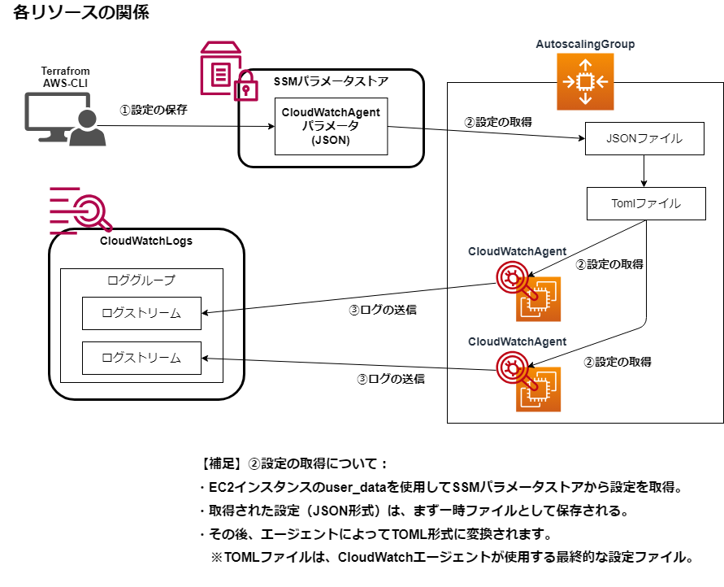

# Terraform勉強-第23回：CloudWatchエージェント, SSMパラメータストアでログを CloudWatch Logs に送信する

githubリポジトリ："https://github.com/shu130/terraform-study23"

## テーマ: 
  - EC2 オートスケーリンググループでApacheを導入し、**CloudWatchエージェントを利用してアクセスログとエラーログを CloudWatch Logs に送信する**環境を構築
  - **ASG (Auto Scaling Group)** を使用して EC2 インスタンスをスケーリングし、Web サーバの冗長性を確保
  - **SSMパラメータストア** を活用してCloudWatch エージェントの設定を共有、複数インスタンスへの一貫した設定配布

## ディレクトリ

```text
.
├── provider.tf
├── vpc.tf
├── iam.tf
├── autoscaling.tf
├── cloudwatch.tf
├── ssm.tf
├── scripts
│   └── fetch_cloudwatch_config.sh
├── variables.tf
├── terraform.tfvars
└── outputs.tf
```

## 概要図




## コード作成と理解

### 1. **IAM ロールとポリシーとインスタンスプロファイル**

   - **ASG**用IAM ロールを作成
   - CloudWatch エージェントがCloudWatch Logs にログ送信できるように、**CloudWatchAgentServerPolicy** ポリシーを IAM ロールにアタッチ
   - EC2 インスタンスが SSM パラメータストアから設定情報を取得できるように、**AmazonSSMReadOnlyAccess** ポリシーもIAM ロールにアタッチ
   - 作成した IAM ロールを **IAM インスタンスプロファイル** として定義し、Auto Scaling Group (ASG) のインスタンスが起動時にこの IAM ロールを使用

```hcl:./iam.tf
# ./iam.tf

# IAMロールを作成
resource "aws_iam_role" "cloudwatch_agent_role" {
  name = "CloudWatchAgentRole"

  assume_role_policy = jsonencode({
    Version = "2012-10-17"
    Statement = [{
      Action    = "sts:AssumeRole"
      Effect    = "Allow"
      Principal = {
        Service = "ec2.amazonaws.com"
      }
    }]
  })
}

# IAMロールに2つのポリシーをアタッチ：
## 1.cloudwatch-Logsへのログ送信用
resource "aws_iam_role_policy_attachment" "cloudwatch_logs" {
  role       = aws_iam_role.cloudwatch_agent_role.name
  policy_arn = "arn:aws:iam::aws:policy/CloudWatchAgentServerPolicy"
}

## 2. SSMパラメータストア接続用
resource "aws_iam_role_policy_attachment" "ssm_access" {
  role       = aws_iam_role.cloudwatch_agent_role.name
  policy_arn = "arn:aws:iam::aws:policy/AmazonSSMReadOnlyAccess"
}

# IAMロールをインスタンスプロファイルとして定義
resource "aws_iam_instance_profile" "cloudwatch_instance_profile" {
  name = "CloudWatchInstanceProfile"
  role = aws_iam_role.cloudwatch_agent_role.name
}
```

### 2. **Auto Scaling Group(ASG)**

 - **IAM インスタンスプロファイル**を通じて、ASG 内のすべての EC2 インスタンスが一貫して CloudWatch Logs へのアクセスと、SSM パラメータストアから設定を取得
 - EC2 インスタンスのスケールイン/スケールアウトを自動化
 - `user_data` スクリプトによりASG でインスタンスが起動する際に、Apache をインストールし、CloudWatch エージェントの設定ファイルを取得して、CloudWatch Logs にログを送信


```hcl:./autoscaling.tf
#./autoscaling.tf

# 起動テンプレート作成
resource "aws_launch_template" "web_launch_template" {
  name_prefix = "${var.ec2_instance_name}-lt-"
  image_id      = var.ec2_ami
  instance_type = var.ec2_instance_type
  key_name      = var.ec2_key_pair
  
  # インスタンスプロファイルを適用
  iam_instance_profile {
    name = aws_iam_instance_profile.cloudwatch_instance_profile.name
  }

  network_interfaces {
    associate_public_ip_address = true
    security_groups = [aws_security_group.asg_sg.id]
  }

  # user_dataスクリプトを指定
  user_data = base64encode(templatefile("${path.module}/scripts/fetch_cloudwatch_config.sh", {}))

  tag_specifications {
    resource_type = "instance"
    tags = {
      Name = "${var.ec2_instance_name}"
    }
  }
}

# オートスケール設定
resource "aws_autoscaling_group" "web_asg" {
  desired_capacity    = 2
  max_size            = 4
  min_size            = 2
  vpc_zone_identifier = aws_subnet.public_subnets[*].id
  launch_template {
    id      = aws_launch_template.web_launch_template.id
    version = "$Latest"
  }

  tag {
    key   = "Name"
    value = "${var.ec2_instance_name}"
    propagate_at_launch = true
  }
}
```

>#### user_dataスクリプト(`fetch_cloudwatch_config.sh`)について：

 - 初回起動時に自動実行 
 - インスタンス起動時にApacheとCloudWatchエージェントをインストール
 - SSMパラメータストアからCloudWatchエージェントの設定を取得
 - 動的にインスタンスIDを取得して設定に反映
 
```bash:./scripts/fetch_cloudwatch_config.sh
# ./scripts/fetch_cloudwatch_config.sh

#!/bin/bash
# Apacheのインストールと起動
yum update -y
yum install -y httpd
systemctl start httpd
systemctl enable httpd

# CloudWatchエージェントのインストール
yum install -y amazon-cloudwatch-agent
# jqのインストール
yum install -y jq

# SSMパラメータストアからCloudWatch設定情報を取得し、エージェント起動
INSTANCE_ID=$(curl -s http://169.254.169.254/latest/meta-data/instance-id)
aws ssm get-parameter --name "AmazonCloudWatch-ForwardProxy" --query "Parameter.Value" --output text --region "us-west-2" | \
  jq --arg id "$INSTANCE_ID" '.logs.logs_collected.files.collect_list[] |= (.log_stream_name = $id)' | \
  sudo tee /opt/aws/amazon-cloudwatch-agent/etc/amazon-cloudwatch-agent.json > /dev/null

/opt/aws/amazon-cloudwatch-agent/bin/amazon-cloudwatch-agent-ctl \
  -a fetch-config -m ec2 -s -c file:/opt/aws/amazon-cloudwatch-agent/etc/amazon-cloudwatch-agent.json
```


### 3. **SSM パラメータストア**

  - `aws_ssm_parameter` リソースで、CloudWatch エージェントの設定情報を保存
  - EC2インスタンスの起動スクリプト (`fetch_cloudwatch_config.sh`)によって、  
  SSMから設定を取得し、jqでプレースホルダ `{instance_id}` を実際のインスタンスIDに置き換え

```hcl:./ssm.tf
# CloudWatchエージェントの設定をSSMパラメータストアへ保存
resource "aws_ssm_parameter" "cloudwatch_config" {
  name  = "AmazonCloudWatch-ForwardProxy"
  type  = "String"
  value = jsonencode({
    logs = {
      logs_collected = {
        files = {
          collect_list = [
            {
              file_path        = "/var/log/messages"
              log_group_name   = "var-log-messages"
              log_stream_name  = "{instance_id}"
              timestamp_format = "%b %d %H:%M:%S"
            },
            {
              file_path        = "/var/log/httpd/access_log"
              log_group_name   = "HttpAccessLog"
              log_stream_name  = "{instance_id}"
              timestamp_format = "%b %d %H:%M:%S"
            },
            {
              file_path        = "/var/log/httpd/error_log"
              log_group_name   = "HttpErrorLog"
              log_stream_name  = "{instance_id}"
              timestamp_format = "%b %d %H:%M:%S"
            }
          ]
        }
      }
    }
  })
}
```

### 4. **CloudWatch Logs**
   - CloudWatch エージェントは、SSM から取得した設定に基づいてログを収集し、アクセスログとエラーログをCloudWatchロググループに送信
   - ASG のインスタンスごとに異なるログストリーム名を使用して、ログを管理

```hcl:./cloudwatch.tf
# ./cloudwatch.tf

# CloudWatchエージェントのログ送信先：
## 1.アクセスロググループ
resource "aws_cloudwatch_log_group" "http_access_log" {
  name              = "HttpAccessLog"
  retention_in_days = 7
}

## 2. エラーロググループ
resource "aws_cloudwatch_log_group" "http_error_log" {
  name              = "HttpErrorLog"
  retention_in_days = 7
}
```
## リソース作成後、動作確認にて問題なし

### 1. **Apacheのアクセスログ**
```bash
tail -f /var/log/httpd/access_log
```
- 実際にアクセスしたときに、新しいログが生成される  
  (http://＜EC2パブリックIP＞ でアクセス)

### 2. **Apacheのエラーログ確認**
```bash
tail -f /var/log/httpd/error_log
```
- エラー時にログが出力されている  
    (http://＜EC2パブリックIP/nonexistpage＞ でアクセス)


### 3. **Amazon CloudWatchコンソール**
- AWSコンソールにアクセス  
- 「CloudWatch」→「ロググループ」で、`var-log-messages`、`HttpAccessLog`、`HttpErrorLog`の3つのロググループがある
- 3つのグループでそれぞれのログストリームが作成されておりログ表示できた
- 
### 4. **CloudWatchエージェントのステータス**
```bash
sudo /opt/aws/amazon-cloudwatch-agent/bin/amazon-cloudwatch-agent-ctl -m ec2 -a status
```
- エージェントが正常に稼働

### 5. **CloudWatchエージェントの設定ファイルの内容**
```bash
cat /opt/aws/amazon-cloudwatch-agent/etc/amazon-cloudwatch-agent.json
```
- 設定ファイルが正しく取得されており、インスタンスIDが設定されている

### 6. **CloudWatchエージェントのログ**
```bash
cat /opt/aws/amazon-cloudwatch-agent/logs/amazon-cloudwatch-agent.log
```
- エージェントの起動状況やエラーの詳細が出力

---
今回はここまでにしたいと思います。


